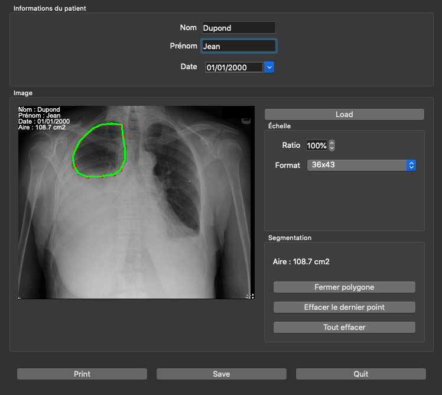

# POOW Segmentation

Application permettant de segmenter manuellement une image médicale.

Le polygone définit par l'utilisateur est affiché sur l'image
et le programme calcule son aire.
Les informations du patient sont imprimées sur l'image.



# Installation

## Prérequis

- Un compilateur C++ ;
- la librairie *Qt* <https://www.qt.io>.

## Compiler les sources

1. Cloner le repo

```
git clone https://github.com/LouiseKuhl/segmentation.git
cd segmentation
```

2. Créer un Makefile avec *qmake*

```
qmake
```

3. Compiler les sources

```
make -j4 && make clean
```

4. Ouvrir l'application

```
open PROJET.app
```

# Features principales

- Segmenter une partie de l'image ;
- calculer l'aire de la partie segmentée ;
- imprimer les informations du patient sur l'image.

# Contacts

Application créée par Louise Kuhl dans le cadre d'un projet
informatique.

Signaler les problèmes à <mailto:louise.kuhl@hotmail.fr>.
